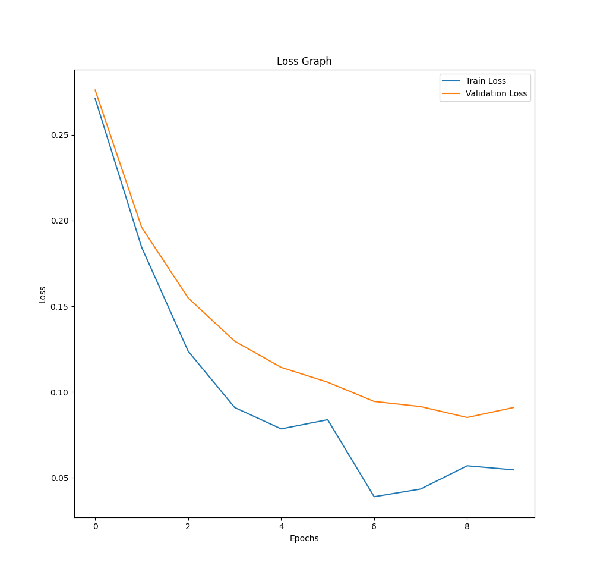

# MNIST Classification from Scratch

A fully-connected neural network built **from scratch using only NumPy**, trained to classify handwritten digits from the MNIST dataset. No PyTorch, no TensorFlow — every component from forward pass to backpropagation is implemented manually.

**Test Accuracy: 98.21%**

---

## Project Structure

```
MNIST_Classification_from_scratch/
├── main.py                  # Training, testing, and display logic
├── Network/
│   ├── network.py           # NeuralNetwork class — forward/backward/update
│   └── denselayer.py        # DenseLayer — the core building block
├── Utilities/
│   ├── activation.py        # ReLU, Sigmoid, Tanh, Softmax (forward + backward)
│   ├── loss.py              # MSELoss, CrossEntropyLoss (forward + backward)
│   └── utilities.py         # Weight initializer, Adam optimizer, Hyperparameters
├── Data/
│   └── MNIST.py             # MNIST loading, normalization, one-hot encoding, splitting
└── Results/
    └── train_val_loss_plot.png
```

---

## Architecture

| Layer | Input | Output | Activation |
|---|---|---|---|
| Dense 1 | 784 | 500 | ReLU |
| Dense 2 | 500 | 250 | ReLU |
| Dense 3 | 250 | 100 | ReLU |
| Dense 4 | 100 | 10  | Softmax |

Each layer includes **Batch Normalization** between the linear transform and the activation function.

---

## What's Implemented from Scratch

**Core components:**
- Forward and backward pass for fully-connected layers
- Backpropagation through Batch Normalization
- Softmax with full Jacobian-based backward pass
- Cross-Entropy loss with analytic gradient

**Activation functions** (forward + backward): ReLU, Sigmoid, Tanh, Softmax

**Regularization:**
- Batch Normalization with learnable γ and β
- L2 Weight Regularization (weight decay)
- Dropout with inverted scaling

**Optimization:**
- Adam optimizer with bias correction, implemented per-layer for weights, biases, γ, and β
- Xavier weight initialization

---

## Hyperparameters

All hyperparameters are configured in a single dataclass in `Utilities/utilities.py`:

```python
@dataclass
class Hyperparameters:
    architecture_sizes   = [784, 500, 250, 100, 10]
    activation_functions = ['ReLU', 'ReLU', 'ReLU', 'Softmax']
    batch_size           = 250
    epochs               = 15
    dropout_rate         = 0.2
    lambda_L2            = 1e-2
    learning_rate        = 3e-4
    adam_delta           = 0.9
    adam_gamma           = 0.999
    val_split            = 0.1
    test_split           = 0.2
```

---

## Results

| Metric | Value |
|---|---|
| Test Accuracy | **98.21%** |
| Test Loss | 0.110 |
| Final Train Loss | ~0.063 |
| Final Val Loss | 0.111 |

The validation and test losses are nearly identical, indicating strong generalization with no overfitting to the validation split.



---

## Installation & Usage

**Install dependencies:**
```bash
pip install numpy matplotlib scikit-learn
```

**Run training and evaluation:**
```bash
python3 main.py
```

This will train the network, print per-batch loss and per-epoch validation loss, then report test accuracy and display the loss curve.

**To enable L2 regularization** (on by default in `main.py`):
```python
mnist_classifier.network.enableL2Regularization()
```

**To disable dropout**, set `dropout_rate = 0.0` in the `Hyperparameters` dataclass.

---

## Requirements

- Python 3.10+
- numpy
- matplotlib
- scikit-learn (for dataset loading only)
